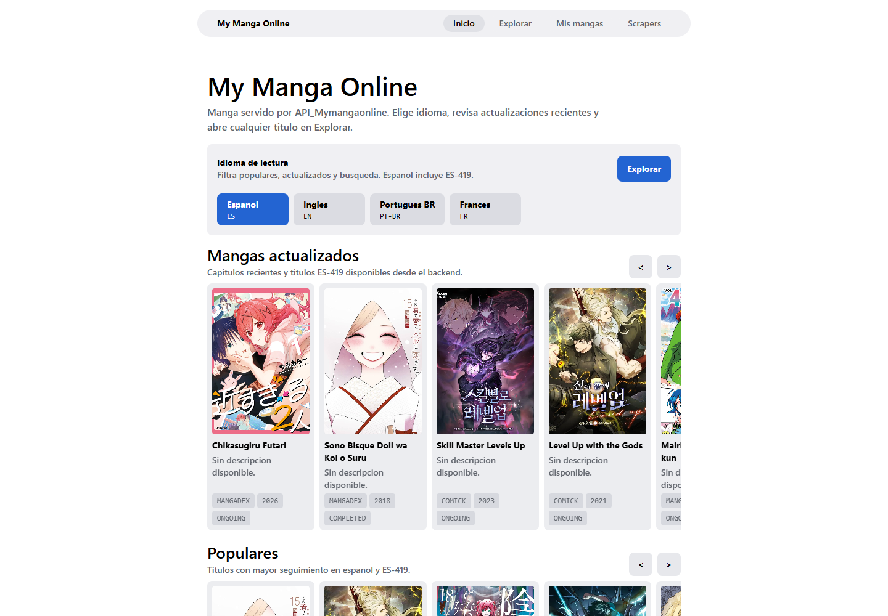
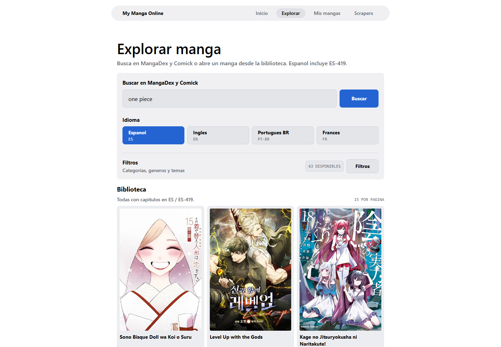
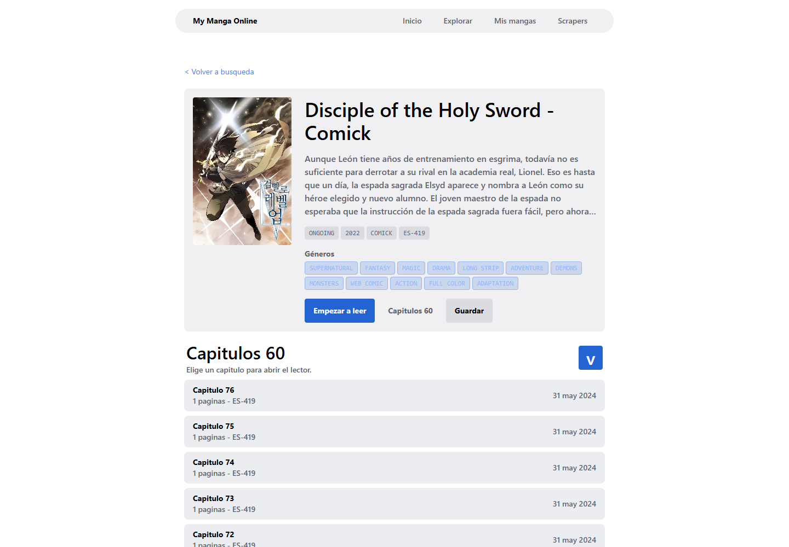

# My Manga Online — Frontend

Aplicación multiplataforma para descubrir, guardar y leer manga desde una interfaz unificada. El frontend consume `API_Mymangaonline`, combina contenido de MangaDex y ComicK, permite filtrar por idioma y presenta descripciones, géneros y capítulos disponibles.

Construida con Expo, React Native, TypeScript y Expo Router. Funciona en web, Android e iOS desde una misma base de código.

## Capturas

### Inicio

Selección del idioma de lectura, mangas actualizados y títulos populares.



### Explorar manga

Búsqueda, filtros por géneros y temas, navegación paginada y resultados combinados de MangaDex y ComicK.



### Detalle del manga

Sinopsis en el idioma seleccionado, etiquetas de géneros, estado, año, fuente y listado de capítulos.



## Funcionalidades

- Catálogo combinado de MangaDex y ComicK.
- Idiomas de lectura: español, inglés, portugués de Brasil y francés.
- Compatibilidad con capítulos `ES` y `ES-419`.
- Búsqueda de manga por título.
- Filtros por categorías, géneros y temas.
- Fichas con portada, descripción localizada, metadatos y géneros.
- Traducción de respaldo para las sinopsis de ComicK.
- Listado de capítulos con orden ascendente o descendente.
- Registro de capítulos vistos.
- Biblioteca personal para guardar mangas.
- Interfaz adaptable para web y dispositivos móviles.
- Tema claro u oscuro según la configuración del sistema.

## Tecnologías

| Tecnología | Uso |
| --- | --- |
| Expo 56 | Desarrollo y ejecución multiplataforma |
| React 19 | Construcción de la interfaz |
| React Native | Componentes nativos y web |
| Expo Router | Navegación basada en archivos |
| TypeScript | Tipado estático |
| Expo Image | Carga y optimización de portadas |
| React Native Reanimated | Animaciones de la aplicación |

## Requisitos

- Node.js 20 o superior.
- npm.
- El proyecto `API_Mymangaonline` instalado y en ejecución.
- Android Studio, Xcode o Expo Go si se desea ejecutar fuera del navegador.

## Instalación

El repositorio contiene el frontend y la API en directorios separados:

```text
Mymangaonline/
├── API_Mymangaonline/   # Backend
└── Mymangaonline/       # Frontend Expo
```

### 1. Iniciar la API

Desde la raíz del repositorio:

```bash
cd API_Mymangaonline
npm install
npm run dev
```

La API se ejecuta por defecto en `http://localhost:3000/api`.

### 2. Iniciar el frontend

En otra terminal:

```bash
cd Mymangaonline
npm install
npm run web
```

Expo mostrará la URL local. Normalmente se puede abrir la aplicación en:

```text
http://localhost:8081/reader
```

## Configuración de la API

El frontend selecciona automáticamente una URL adecuada para cada plataforma:

- Web e iOS Simulator: `http://localhost:3000/api`
- Emulador Android: `http://10.0.2.2:3000/api`

Para utilizar otra dirección, crea un archivo `.env.local` dentro del frontend:

```env
EXPO_PUBLIC_MYMANGA_API_URL=http://localhost:3000/api
```

En un dispositivo físico debes reemplazar `localhost` por la IP local del equipo que ejecuta la API.

## Comandos disponibles

```bash
npm run start      # Inicia Expo
npm run web        # Abre la versión web
npm run android    # Abre la versión Android
npm run ios        # Abre la versión iOS
npm run lint       # Ejecuta ESLint
```

## Rutas principales

| Ruta | Descripción |
| --- | --- |
| `/` | Inicio y recomendaciones |
| `/reader` | Catálogo, búsqueda y filtros |
| `/manga` | Detalle del manga y capítulos |
| `/chapter` | Lector del capítulo |
| `/library` | Cuenta y mangas guardados |
| `/scrapers` | Fuentes adicionales de contenido |
| `/extensions` | Información de extensiones disponibles |

## Estructura del frontend

```text
src/
├── app/          # Pantallas y rutas de Expo Router
├── components/   # Componentes visuales reutilizables
├── constants/    # Tema, tamaños y espaciado
├── hooks/        # Hooks de tema y plataforma
└── services/     # Cliente de API, MangaDex y biblioteca local
```

## Validación

Antes de publicar cambios ejecuta:

```bash
npm run lint
```

Las capturas del README se encuentran en `output/playwright/` y fueron generadas desde la aplicación web en ejecución.
