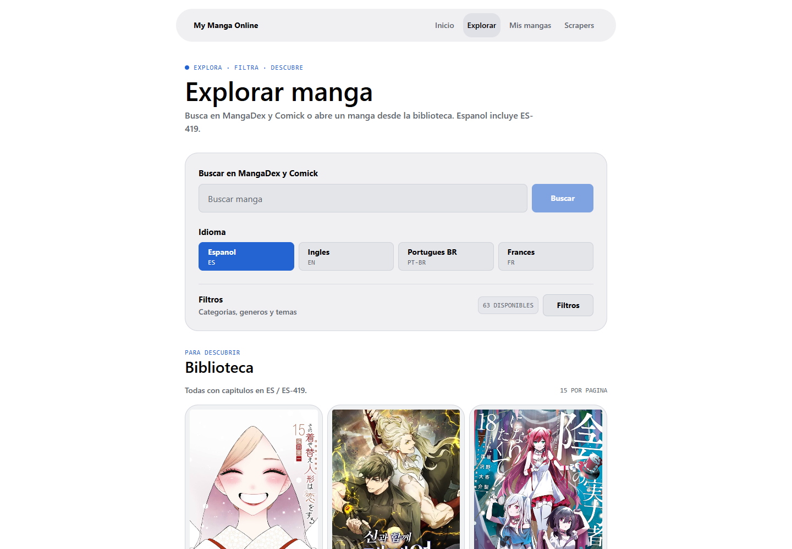
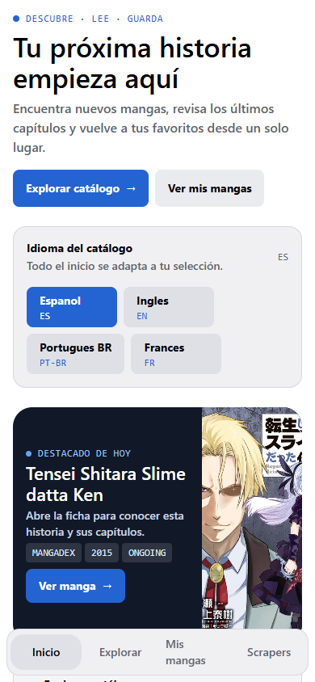
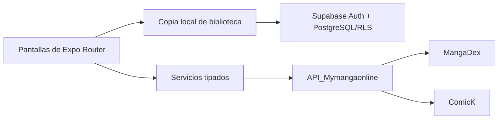

<div align="center">

# My Manga Online

**Una aplicación multiplataforma para descubrir, guardar y leer manga desde una sola interfaz.**

[](https://expo.dev/)
[](https://react.dev/)
[](https://www.typescriptlang.org/)
[](#plataformas)
[](./LICENSE)

<p>
  <a href="https://mymangaonline-personal.pages.dev"><strong>Abrir aplicación web</strong></a>
</p>

</div>


My Manga Online combina catálogos de MangaDex y ComicK, ofrece búsqueda y filtros por idioma o género, sincroniza una biblioteca personal entre navegadores y permite continuar la lectura desde un lector adaptable.

## Características

- Catálogo agregado con contenido de MangaDex y ComicK.
- Búsqueda por título y filtros por categorías, géneros y temas.
- Lectura en español, inglés, portugués de Brasil y francés.
- Compatibilidad con capítulos `ES` y `ES-419`.
- Fichas con portada, descripción localizada, estado, año, autores y géneros.
- Capítulos paginados, ordenables y con seguimiento de lectura.
- Perfil con correo y contraseña, sesión persistente y biblioteca sincronizada entre navegadores.
- Interfaz responsive con navegación específica para escritorio y móvil.
- Tema claro u oscuro según la configuración del sistema.
- Estados de carga, error y contenido vacío en los flujos asíncronos.

## Vista previa

### Catálogo



### Experiencia móvil

<p align="center">
  
</p>

### Detalle del manga


## Arquitectura


```mermaid
flowchart LR
    UI["Pantallas de Expo Router"] --> S["Servicios tipados"]
    UI --> B["Copia local de biblioteca"]
    B --> SB["Supabase Auth + PostgreSQL/RLS"]
    S --> API["API_Mymangaonline"]
    API --> MD["MangaDex"]
    API --> CK["ComicK"]
```

| Capa | Ubicación | Responsabilidad |
| --- | --- | --- |
| Rutas y pantallas | `src/app/` | Navegación, composición y estados de pantalla |
| Componentes | `src/components/` | Navegación y elementos visuales reutilizables |
| Servicios | `src/services/` | Cliente de API, perfil, sincronización y copia local |
| Hooks | `src/hooks/` | Tema, plataforma y diseño responsive |
| Diseño | `src/constants/theme.ts` | Colores, espaciado y tokens visuales |

## Tecnologías

| Tecnología | Uso |
| --- | --- |
| Expo 56 | Desarrollo, compilación y ejecución multiplataforma |
| React 19 | Construcción de la interfaz |
| React Native 0.85 | Componentes nativos y compatibilidad web |
| Expo Router | Navegación tipada basada en archivos |
| TypeScript | Tipado estático |
| Expo Image | Carga y optimización de portadas |
| Reanimated | Animaciones e interacciones |
| Supabase | Autenticación y biblioteca remota protegida con RLS |

## Requisitos

- Node.js 22 (Expo SDK 56 requiere Node 20.19 o superior; 22 es la versión recomendada para este workspace).
- npm.
- Una instancia de [API_Mymangaonline](https://github.com/bravoisaac/API_Mymangaonline) en ejecución.
- Un proyecto de Supabase configurado según [`supabase/README.md`](./supabase/README.md).
- Expo Go, Android Studio o Xcode solamente si se utilizará una plataforma móvil.

## Instalación

```bash
git clone https://github.com/bravoisaac/Mymangaonline.git
cd Mymangaonline
npm ci
```

Crea `.env.local` en la raíz del proyecto y define la URL de la API:

```env
EXPO_PUBLIC_MYMANGA_API_URL=http://localhost:3000/api
EXPO_PUBLIC_SUPABASE_URL=https://tu-proyecto.supabase.co
EXPO_PUBLIC_SUPABASE_PUBLISHABLE_KEY=sb_publishable_reemplazar
```

> Las variables `EXPO_PUBLIC_*` quedan incluidas en el cliente. Usa sólo la clave Publishable de Supabase; nunca una clave `service_role`.

Inicia la aplicación web:

```bash
npm run web
```

Abre [http://localhost:8081](http://localhost:8081). En Android Emulator, la URL predeterminada de la API es `http://10.0.2.2:3000/api`; en un dispositivo físico debes usar la IP local del equipo que ejecuta la API.

## Plataformas

```bash
npm run web      # Navegador
npm run android  # Android
npm run ios      # iOS
```

## Scripts

| Comando | Descripción |
| --- | --- |
| `npm start` | Inicia el servidor de desarrollo de Expo |
| `npm run web` | Inicia la versión web |
| `npm run android` | Abre el proyecto en Android |
| `npm run ios` | Abre el proyecto en iOS |
| `npm run lint` | Ejecuta ESLint |
| `npm run typecheck` | Valida los tipos sin generar archivos |
| `npm run export:web` | Genera el export estático para web |
| `npm run smoke:deploy` | Comprueba un despliegue publicado |

## Rutas principales

| Ruta | Descripción |
| --- | --- |
| `/` | Inicio, recomendaciones y selector de idioma |
| `/reader` | Catálogo, búsqueda y filtros |
| `/manga` | Detalle, metadatos y capítulos |
| `/chapter` | Lector de capítulos |
| `/library` | Biblioteca personal |
| `/scrapers` | Búsqueda en proveedores adicionales |
| `/extensions` | Fuentes y extensiones disponibles |

## Calidad y validación

Antes de publicar cambios:

```bash
npm run lint
npm run typecheck
npm run export:web
```

## Despliegue

- [Abrir la instancia personal desplegada](https://mymangaonline-personal.pages.dev)
- [Producción con Docker Compose y Nginx](./PRODUCTION.md)
- [Cloudflare Pages + Render Free, mediante carga manual y sin Git](./DEPLOY_FREE.md)

Para uso personal gratuito, el export `dist/` se sube directamente a Cloudflare Pages y la API se entrega a Render como una imagen Docker existente. No es necesario conectar un repositorio Git. La configuración Docker Compose alternativa publica un único origen: Nginx sirve el export estático y reenvía `/api` al backend.

## Licencia y uso

Distribuido bajo la [licencia MIT](./LICENSE). Este proyecto es personal, educativo y de portafolio; no almacena ni redistribuye capítulos por cuenta propia.

Las capturas de esta documentación fueron generadas desde la aplicación real en `http://localhost:8081`.
